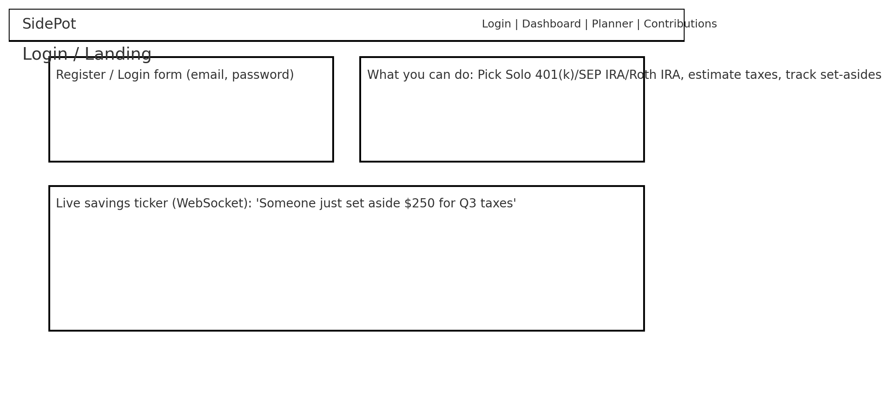
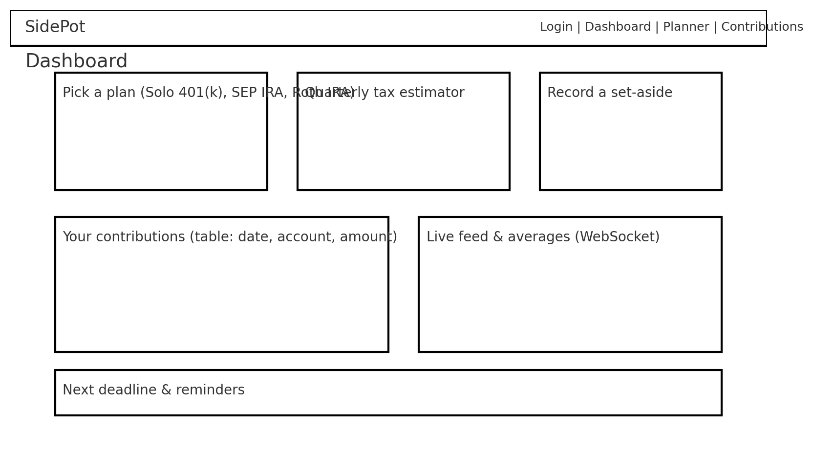
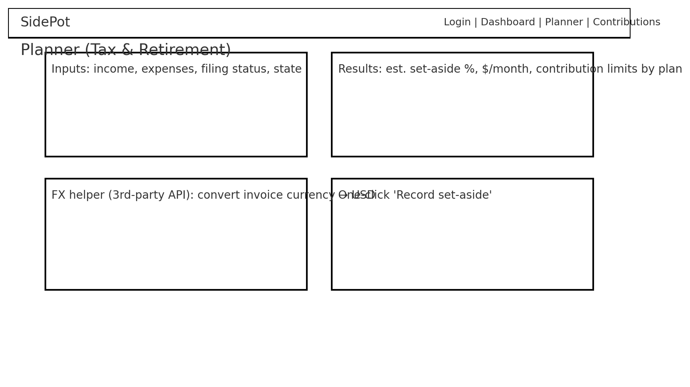
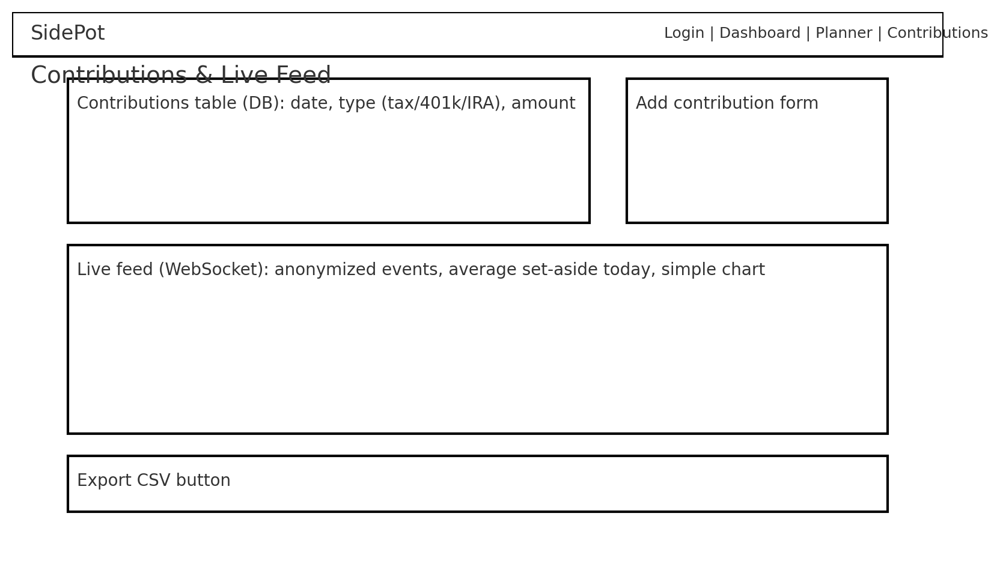

# Side Pot

A simple web app that helps self-employed folks **estimate tax set-asides, choose a retirement option (Solo 401(k), SEP IRA, Roth IRA), and track contributions**—with a tiny live feed that nudges savings behavior.

> **Class disclaimer:** Educational demo only. **Not** tax or investment advice.

---

## Prerequisites

Before working on this deliverable, complete the preceding topics:

- ☑ Course Introduction  
- ☑ AWS account  
- ☐ Startup application  
- ☑ Demo day submission  
- ☐ Let’s play Simon  
- ☐ Git  
- ☑ GitHub  

> These are course checklist items; they’re here just to mirror the spec’s order.

---

## Getting started

### 🚀 Elevator pitch
When you’re self-employed, paychecks don’t withhold taxes or fund retirement automatically. **Side Pot** makes it painless: enter income/expenses, get a **monthly tax set-aside estimate**, see **basic contribution limits** for Solo 401(k)/SEP IRA/Roth IRA, and **record what you actually set aside**. A small real-time feed (anonymized) shows others saving too, so you stay motivated.

### ✨ Key features
- **Tax set-aside estimator** (simple, classroom formula)
- **Plan picker cards**: Solo 401(k), SEP IRA, Roth IRA (plain-language limits/notes)
- **Contribution tracker** for taxes and retirement
- **Live savings feed** (WebSocket) showing anonymized “someone saved $X”
- **3rd-party API helper** to convert foreign invoice amounts to USD (FX)

---

## Design sketches

> Place these images in your repo at `docs/wireframes/` so the links work.

### Login / Landing


### Dashboard


### Planner (Tax & Retirement)


### Contributions & Live Feed


---

## Represent all technologies

### **HTML**
- Semantic structure for the SPA shell and accessible forms (labels, inputs, buttons).
- Single-page app root (`<div id="root">`) with clear sections: Login, Dashboard, Planner, Contributions.

### **CSS**
- Mobile-first responsive layout, good whitespace/contrast.
- Small animations (hover states, success toast), optional light/dark theme.

### **React**
- Components & routing with `react-router`:
  - `/` → `Login`
  - `/dashboard` → quick actions + live ticker
  - `/planner` → inputs (income, expenses, filing status/state) → calculated results + plan cards
  - `/contributions` → table + add/delete + live feed
- State/effects for auth, planner inputs/results, contributions, and WebSocket subscription.

### **Service** (backend web service)
Node/Express server exposing multiple endpoints:
- **Auth**
  - `POST /api/auth/register` – create user (bcrypt)
  - `POST /api/auth/login` – set JWT via HTTP-only cookie
  - `POST /api/auth/logout` – clear cookie
- **Planner**
  - `POST /api/planner/estimate` → returns `{ percent, monthlySetAside }` (deterministic class formula; not advice)
  - `GET /api/planner/limits` → static JSON cards for Solo 401(k), SEP IRA, Roth IRA
- **Contributions**
  - `GET /api/contributions` → list current user’s rows
  - `POST /api/contributions` → add `{ type: "tax"|"solo401k"|"sep"|"roth", amount, date }`
  - `DELETE /api/contributions/:id`
- **3rd-party API (proxy)**
  - `GET /api/fx?base=EUR&amount=1000` → server fetches a free FX rate API and returns USD conversion (keeps CORS simple)

### **Database**
Persists users, profiles, and contributions (MongoDB/Postgres or a JSON DB for class):
- `users { id, email, hash }`
- `profiles { userId, filingStatus, state }`
- `contributions { id, userId, type, amount, date }`

### **WebSocket**
- Server emits a `savings_event` on each new contribution:
  ```json
  { "type": "tax|solo401k|sep|roth", "amount": 125.00, "ts": 1736551200000 }
